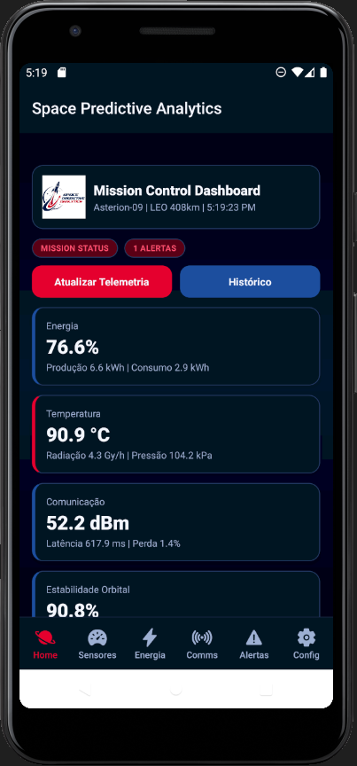
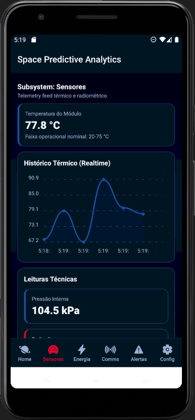
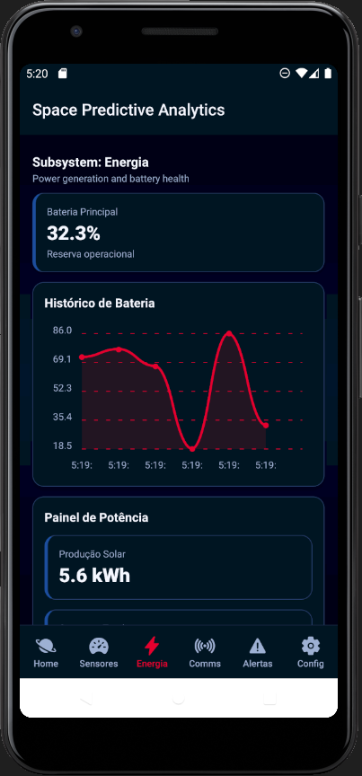
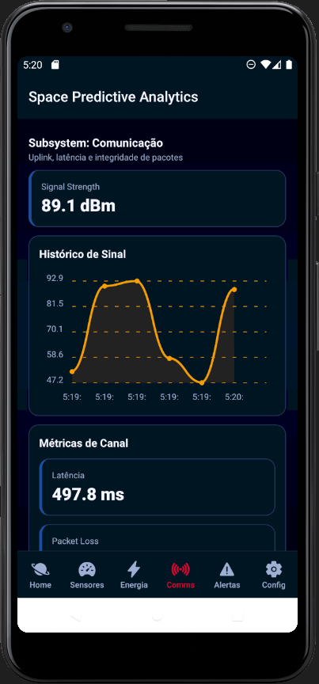
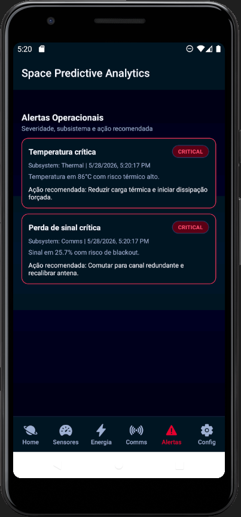
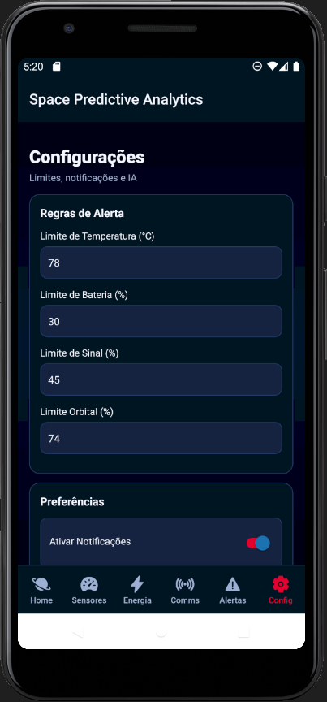
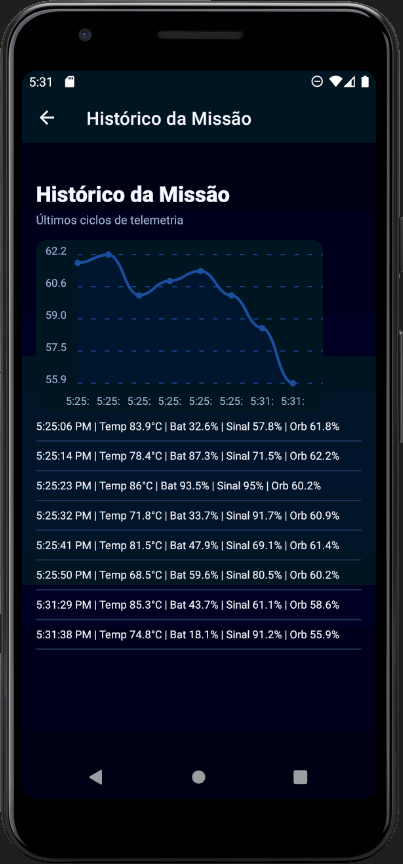

# SpaceGuard AI

### Global Solution 2026.1 - Cross-Platform Application Development | FIAP

<p align="center">
  
</p>

<p align="center">
  
  
  
  
  
</p>

---

## Sobre o Projeto

O SpaceGuard AI e uma plataforma mobile desenvolvida para simular um sistema inteligente de monitoramento espacial e operacoes orbitais em tempo real.

O aplicativo foi criado no desafio Space Predictive Analytics da Global Solution FIAP 2026.1 para demonstrar como tecnologias modernas apoiam o monitoramento de sensores, estabilidade orbital, comunicacao e consumo energetico em ambientes aeroespaciais criticos.

A solucao combina:

- Dashboards analiticos
- Alertas automaticos
- Processamento de dados simulados
- Persistencia local
- Integracao com APIs externas
- Inteligencia Artificial
- Interface inspirada em centros de controle espacial

---

## Objetivo da Solução

Oferecer uma experiencia proxima a uma central real de controle de missao espacial.

A plataforma permite:

- Monitorar indicadores criticos da missao
- Detectar falhas automaticamente
- Gerar alertas operacionais
- Analisar metricas da missao
- Simular tomada de decisao em cenarios criticos

---

## Diferenciais do Projeto

- Interface inspirada em centros de controle espacial
- Dashboards em tempo real por subsistema
- Sistema inteligente de alertas criticos
- Integracao com NASA APOD API
- IA generativa para analise operacional
- Persistencia local com AsyncStorage
- Arquitetura escalavel com TypeScript
- Componentizacao reutilizavel

---

## Equipe

| Nome | RM |
| --- | --- |
| Joao Victor Alves de Abreu | RM 564946 |
| Luiz Henrique Barbosa Dias | RM 562399 |

---

## Funcionalidades

### Entregas Principais

- Navegacao com Expo Router
- Dashboard de missao na Home
- Dashboards de Sensores, Energia e Comunicacao
- Sistema de alertas com severidade e recomendacao
- Persistencia com AsyncStorage
- Configuracoes operacionais com validacao
- Historico da missao
- Notificacoes locais

### Diferenciais Tecnicos

- Integracao NASA APOD
- IA generativa para suporte a decisao
- Graficos operacionais com react-native-chart-kit
- Interface consistente para ambiente critico

---

## Telas do Aplicativo

<p align="center">
  
  
  
</p>
<p align="center">
  
  
  
</p>
<p align="center">
  
</p>

---

## Arquitetura do Projeto

```text
app/
  (tabs)/
  home/
  sensors/
  energy/
  communication/
  alerts/
  settings/
components/
context/
hooks/
services/
utils/
types/
assets/
```

---

## Tecnologias Utilizadas

- React Native
- Expo
- Expo Router
- TypeScript
- Context API
- AsyncStorage
- react-native-chart-kit
- react-native-svg
- react-native-reanimated
- expo-notifications
- expo-linear-gradient
- @expo/vector-icons

---

## APIs Utilizadas

### NASA APOD API

A aplicacao utiliza a API oficial da NASA para exibir a imagem astronomica do dia.

- https://api.nasa.gov/

### IA Generativa

Suporte opcional com provedores externos para:

- Interpretar dados operacionais
- Identificar riscos da missao
- Gerar analises tecnicas
- Sugerir acoes preventivas

---

## Como Executar o Projeto

### Pre-requisitos

- Node.js 20+
- npm 10+
- Expo Go no dispositivo ou emulador Android/iOS

### Instalacao

```bash
npm install
```

### Configuracao de ambiente

Crie um arquivo `.env` na raiz:

```bash
EXPO_PUBLIC_NASA_API_KEY=sua_chave_nasa
```

As chaves de IA sao configuradas em runtime na tela Configuracoes.

### Execucao

```bash
npm run start
```

Android:

```bash
npm run android
```

iOS:

```bash
npm run ios
```

Web:

```bash
npm run web
```

Validacao de tipos:

```bash
npm run typecheck
```

---

## Video de Demonstracao

- https://youtube.com/seu-video-global-solution

---


